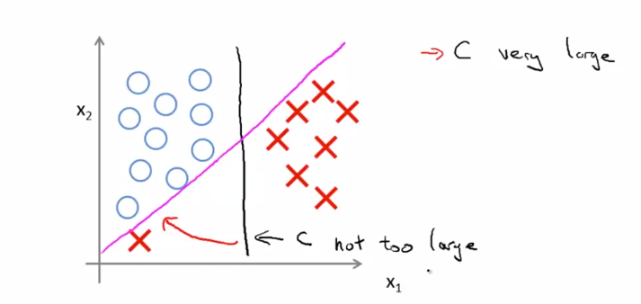
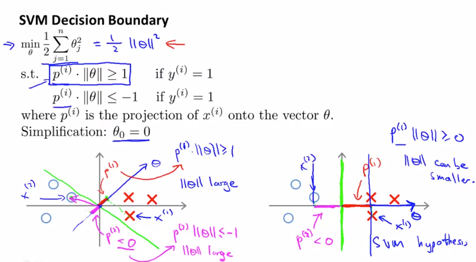
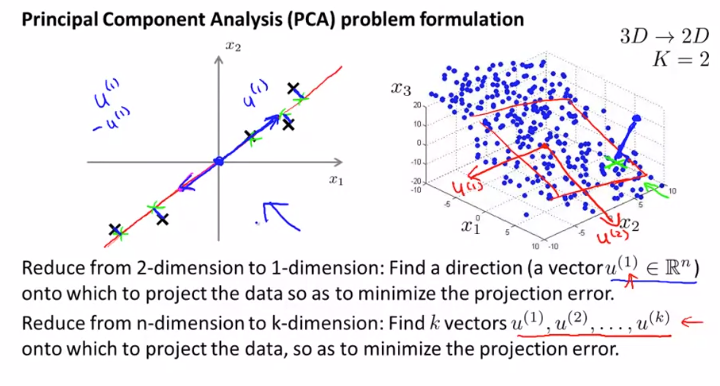
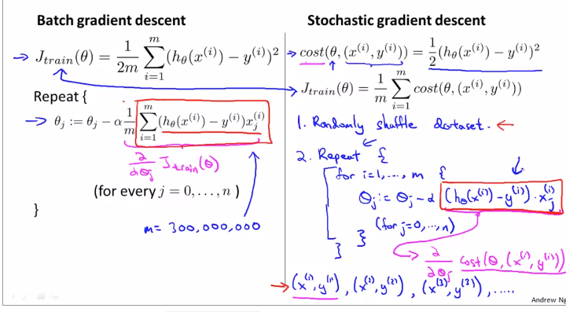
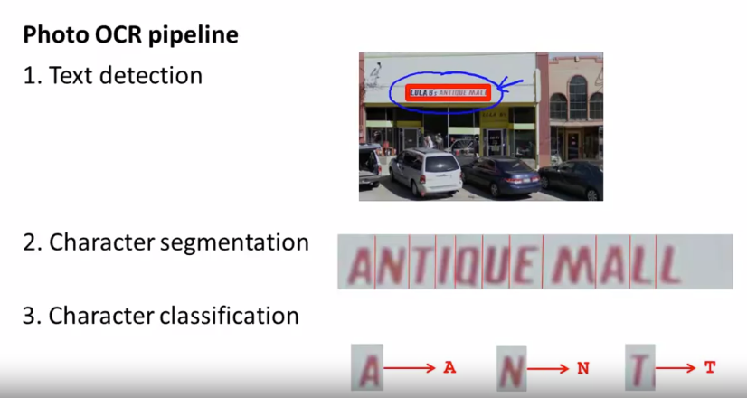
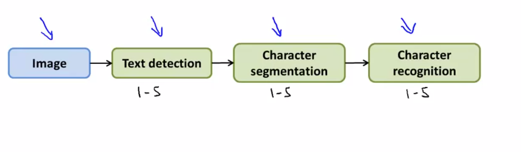

# Andrew机器学习

# 第七周 SVM(support vector machines)

## Large Margin Classification

引入$cost_0()$,$cost_1()$来代替下图中的两个近似的复杂函数。

改变系数，去掉系数m引出目标函数

Note:整个式子同乘一个系数，对于优化的结果无影响。

## Large Margin Machine

SVM会自动找到分开两类的Decision Boundary,DB以最大间隔分开了两类样本，让SVM拥有了一定的鲁棒性。

考虑C的大小的影响，如果C非常大，那么SVM对一个‘突变’的样本非常敏感，如下图。记住C的作业用其实等价于$\frac{1}{\lambda}$

### Mathematics Behind Large Margin Classification

**Intro**

$U=\begin{bmatrix}u_1 \\ u_2 \end{bmatrix}              V=\begin{bmatrix}v_1 \\ v_2 \end{bmatrix}$

$\lVert U\rVert$ is the square root of squared $u_1$ and $u_2$, is also the length of vector $U$.Let's plot it.

$P$ is the length of projection of $V$ onto $U$.Just is like that.
$$
U^{\mathrm{T}}V=P*\lVert U\rVert\\=u_1*v_1+u_2*v_2\\
=V^{\mathrm{T}}U
$$
In more detial, the sign of $U^{\mathrm{T}}V$ may be negative.

 

类似的把$\theta^{\mathrm T}x^{(i)}$的公式作上述的变化，可以得到各个样本在$\theta$直线上的投影。

对SVM进行一定的简化，规定$\theta_0=0$,假设特征只有两个，那么$\theta$仅仅只有两个变量，如此便可方便的画出$\theta$向量和每个$x$的向量，并投影x到$\theta$上。可以看出，为了符合限制条件，对于$y^{(i)}=1$,$\theta^{\mathrm T}x^{(i)}$必须大于1,那么如果$P^{(i)}$较小，则$\lVert \theta \rVert$较大，则不利于约束条件。所以理想状况应该是$P^{(i)}$较大，$\lVert \theta \rVert$较小，如下图的右部分所示。

positive and negative examples is really the magnitude of this gap. The magnitude of this margin is exactly the values of P1, P2, P3 and so on. And so by making the margin large, by these tyros P1, P2, P3 and so on that's the SVM can end up with a smaller value for the norm of theta which is what it is trying to do in the objective. And this is why this machine ends up with enlarge margin classifiers because it is trying to maximize the norm(范数) of these P1 which is the distance from the training examples to the decision boundary.

Finally, we did this whole **derivation**(推导，导数) using this **simplification** that the parameter theta 0 must be equal to 0. The effect of that as I mentioned briefly, is that if theta 0 is equal to 0 what that means is that we are entertaining decision boundaries that pass through the origins of decision boundaries pass through the origin like that, if you allow theta zero to be non 0 then what that means is that you entertain the decision boundaries that did not cross through the origin, like that one I just drew. And I'm not going to do the full derivation that. It turns out that this same large margin proof works in pretty much in exactly the same way. And there's a generalization of this argument that we just went through them long ago through that shows that even when theta 0 is non 0, what the SVM is trying to do when you have this optimization objective.

## Kernels

### Kernels: develop complex nonlinear classifiers

首先看这个similarity函数，我们把一个样本映射成一个新的特征。组合多个landmark的函数的特征值，便可以得到一个样本的新特征（下图没写）。

在高斯核函数的作用下，距离landmark越远，其核函数值越小。可以看到$\sigma^2$起到了一个放大系数的作用，如下图所示

利用核函数构建新特征，并构建假设。可以看到下图出现了一个特殊的椭圆区域（我们仅仅通过高斯函数构建新特征就达到了平时需要高阶多项式特征才能达到的效果！）

### Kernels 2

SVM把每个样本作为一个landmark,如此每个样本都可以映射为一个m个特征值的新样本。

Note: $f_i^{(i)}=1$

小小的修改一下目标函数

Note:不建议自己写，调包

参数问题：类似于上面讨论过的内容

结合图像，思考一下$\sigma^2$如何影响拟合情况。

## SVMs in Practice

Using An SVM

SVM的使用分为两类，一类为不带kernel线性核函数的svm，另一类以高斯核函数为代表的svm。

liblinear可以训练不带核函数的svm

Note: feature scaling

很多核函数其实都是很少用到的，比如String Kernel用于评估两个单词的相似度，多项式核函数都如下图。

**多类分类问题**:类似于之前讲的。

**验证所选择的SVM核函数和参数正确的方法是查看交叉验证集的数据表现如何。**

重要的选择：当特征量和训练样本量变化之时，如何选择，选择何种学习方法？

重点看下图的三种情况：

Note：第三种情况，由于非线性核函数的svm的计算复杂度上升，所以不适合用于大量训练集的情况。

SVM的优化问题是一个convex问题，所以一定找到最优解。

### 错题

If the data are linearly separable, an SVM using a linear kernel will return the same parameters  θ regardless of the chosen value of $C$ (i.e., the resulting value of $\theta$ does not depend on *C*).

This should not be selected

A linearly separable dataset can usually be separated by many different lines. Varying the parameter C will cause the SVM's decision boundary to vary among these possibilities. For example, for a very large value of *C*, it might learn larger values of *θ* in order to increase the margin on certain examples.

Unsuprtvised

# 第八周

## Unsupervised Learning Introduction

Unsupervised learning is a algorithm which find a struction of data without labels.Such as cluster.

## K-Means Algorithm

Kmeans算法包括了两个部分：一是分类， 二是移动形心。

Kmeans用于身体体型划分的应用。

### Optimization Objective

给出目标优化函数。

Kmeans的两个部分其实是对两个部分变量进行优化。

### Random Initialization

随机选点为初始形心点

Andrew给出两个建议：

- 如果分类的簇数比较少，如2-10个，多次运行Kmeans算法并选择结果最优的结果可能有比较好的效果。
- 但是如果分类的簇数很大，可能多次运行的结果没有什么区别，也许会得到一个比较好的局部最优结果。

Andrew不推荐随机化初始化形心点（multiple random initializations），而是更推荐从样本点中随机选K个点。尤其对大量数据有效。

### Choosing the Number of Clusters

一个推荐方法：如果存在的话，选择一个数据拐点作为K的值。

另一个方法：根据现实问题的目的而定分类的类别。

## Motivations

A anther algorithm called dimensionality reduction 

### Data Compression

数据压缩有很多好处，比如节省磁盘空间，加快运行速度等等。举一个3d映射到2d的例子。

### Visualization

将拥有大量特征的数据可视化，就是用到了数据压缩的特点。

## Principal Component Analysis

### Principal Component Analysis Preblem Formulation

1

PCA所做的就是通过K个向量，把N维的数据投影到K维上，减少数据所投影的距离。

### Principal Component Analysis Algorithms(没听懂 Andrew没讲啥)

主要自己太多线代知识不知道罢了。

stands for singular value decomposition？奇异值分解？

## Apply PCA

### Reconstruction from Compressed Representation

从映射的数字重新映射为x的公式如图

### Choosing the Number of Principal Components

PCA要尽量减少原数据和投影再反演的数据尽可能相同。即最小化
$$
\frac{1}{m}\lVert x -  x_{approx} \rVert^2
$$
有一个比较好的评价方法是：99% of variance retained.，即99%的数据可以还原，说明得到的数据比较‘真实’。其计算方法如图左。

### Advice for Applying PCA

将PCA用于模型训练中：

PCA的两个用途

错误的用法：

PCA可以降维，但是不可以用于防止过拟合：PCA仅仅是对X处理，，而不考虑y的变化。

​	PCA更推荐在你的算法无法使用原有数据快速或很好的运行时，才去使用。

​	NOTE:PCA算法必须在mean normalization	的数据上运行。

# 第九周

## Density Estimation

### Anomaly Detection

Anomaly Detection，即异常检测，通过已有数据建立一个模型，检测一个新数据的正常的概率。

比如

### Guassian Distribution

高斯分布即正态分布。这个我太熟了

	

参数估计，如图，但是由于一般基数m比较大,所以用m-1和m没啥区别。

### Algorithm

**假设数据符合高斯分布**

### Developing and Evaluating  an Anomaly Detection System

针对偏斜的数据的评估方法---之前已经讲过的

### Anomaly Detection vs. Supervised Learning

两者之间的不同主要来源于数据集的分布不同。

偏斜的数据使得一般算法难以从大量‘正确的数据'中学习‘错误的结果’

应用

### Choosing What Features to Use

数据不是高斯分布 那就变化一下

从已有数据无法侦测出错误----Error analysis,解决方法是创建一个新特征。

​		例子

### Miltivariate Gaussian Dsitribution(Optional)

定义

### Anomaly Detetion using the Multivariate Gaussin Dsitribution

多变量高斯分布的模型算法

原有的模型其实和多变量高斯模型是等价的

两者的区别：计算能力，特征、样本数量

如果$\sum$矩阵不可逆，无非就是样本数量太少。解决方法如下：

1. 增加样本数量
2. 减少容易的特征（上图右）

### 错题

1.If you have a large labeled training set with many positive examples and many negative examples, the anomaly detection algorithm will likely perform just as well as a supervised learning algorithm such as an SVM.

 **This should not be selected**  AD vs. SVM

Anomaly detection only models the negative examples, whereas an SVM learns to discriminate between positive and negative examples, so the SVM will perform better when you have many positive and negative examples.

2.Suppose you have trained an anomaly detection system that flags anomalies when p(x)p(x) is less than ε, and you find on the cross-validation set that it has too many false positives (flagging too many things as anomalies). What should you do?

- Decrease ε

- Increase ε

**Incorrect**

By increasing ε, you will flag more anomalies, not fewer.

## Predicting Movie Ratings

So, the **recommender system problem** is given this data that has give these r(i, j)'s and the y(i, j)'s to look through the data and look at all the movie ratings that are missing and to try to predict what these values of the question marks should be.并根据给出的打分值，进行推荐。

### Content Based Recommendation

以内容为基础的推荐，即根据电影的类型来进行推荐。

举一个例子，再深一点，就是把评估出一个人的对不同类型电影的口味爱好程度，对不同片子的不同类型进行打分，预测出此人对某一电影的兴趣程度。

目标

## Collaborative Filtering

给出一种思路：差不多就是上面问题的反演。

给出每个人的喜好$\theta$和他们对一部电影$y(i,j)$的评分，则推出电影的“成分”。

之所以叫做collaborative filtering，是因为参与的每个人都努力的打分，去帮助建设者学习电影的特征，才能有效的运转系统。

### Collaborative Filtering Algorithm

Put it together. 这个目标函数有点复杂，好好看看；

其实只不过是把两个目标函数“加”起来了

梯度

## Low Rank Matrix Factorization

### Vectorization: Low Rank Matrix Factorization

真的是向量化，这个矩阵就叫“Low rank matrix  factorization”

定义：两个电影之间的距离

### Implementational Detail:Mean Normalization

如果一个用户从没参与任何打分，则由于优化函数的限制 ，他的参数会被优化为0.

对于一个从没参与过评分的人， 我们可以预测他的评分是该电影的评分的**平均值**。经过Mean Normalization之后，（Note：这里没有除于range）每个人打的分数如下图公式所示。

# 第十周 Large Datasets

## Learing with Large Datasets

复习一下：过拟合和欠拟合 的学习曲线

###  Stochastic Gradient Descent

batch gradient descent 在大量数据m=1e8上计算复杂上十分的复杂。

随机梯度下降算法不同于批量梯度下降算法，他的核心思想是每次迭代仅仅随机根据一个样例来优化参数，不仅仅减少了相比于批量梯度下降算法的计算时间，而且每次优化都可能向最优点前进，从而加速了算法优化的速度。

过程：当然并不出每一次优化都是‘好的’，而且可能也不是全局最优，不过没事，如下图右所示，算法最后会在一个比较好的区域内结束！

### Mini-Batch Gradient Descent

这个其实就是上面所述的两种方法的折中

Mini-batch gradient descent在使用了良好的**向量化**拥有比随机梯度下降更好的效果。

### Stochastic Gradient Descent Convergence

如果不动态改变的随机梯度下降算法的学习率，最终的优化结果可能就是沿着最优化的目标“打转”。

一个可行的方案是随着迭代次数的增加，逐步减小学习速率。

## Advanced Topics

(online learning ) 没听 发呆。。。。。。。

### Map Reduce and Data Parallelism

Map Reduce 将任务和数据分解给每一台机子或者是每一个同一台自己的核，各个部分格子计算子任务，并将任务汇总，达到平行计算的效果。

# 第十一周 OCR应用

简化一下一般的应用架构

例子：人体检测

首先要先训练一个可以检测多个不同的固定像素大小图片中是否有人的分类器，再在图片中多批次的以不同窗口大小进行扫描，并对扫描的每一个结果采用不同的分类器，来检测窗口是否存在人体。

同理文字检测也是如此

**Character segmentation**

类似的是，也是将依次移动窗口，并训练

### Getting Lots of Data by Introducing Distortions

机器学习中 有一个有趣的想法 叫做"人工数据合成"，这并不 适用于每个问题， 为了应用在一个特定的问题中 它有时候能成为 一个简单的途径 来为你的算法获取大量训练数据 人工合成数据的想法 包含两个主要的方面： 第一个是 我们基本上 从头开始创造新的数据 第二个是 如果我们已经有了 一个小的带标记的训练集 然后我们设法放大这个训练集 或者把一个小的训练集 变成一个 更大的训练集 在这个视频里我们两种都会涉及

注意事项以及数据来源

learing curve \ 数据来源 \ 

### Ceiling Analysis: What Part of the Pipeline to Work on Next

**针对pipe系统,**上限分析可以有效的在最应该投入的部分中合理的投入资源，防止过度浪费时间和精力。其核心思想是假设前i（$i=0,1,\cdots n $）部件完美的工作，即给第$i+1$部件绝对正确的数据，查看整个系统工作的正确率是多少，第i个部件的提升的过的系统相比与提升过的第i-1部件的系统的提升如何。

### 错题

4、Suppose you are building an object classier, that takes as input an image, and recognizes that image as either containing a car (y=1 ) or not (y=0 ). For example, here are a positive example and a negative example:
After carefully analyzing the performance of your algorithm, you conclude that you need more positive (y=1 ) training examples. Which of the following might be a good way to get additional positive examples?
A. Apply translations, distortions, and rotations to the images already in your training set.
B. Select two car images and average them to make a third example.
C. Take a few images from your training set, and add random, gaussian noise to every pixel.
**D. Make two copies of each image in the training set; this immediately doubles your training set size.**
答案：A
A正确
B错误，图片取平均后，应该已经看不出车的样子了吧
C 加白噪声等于没加
D 用copies训练，参数不会改变，因为当前参数就是用这个样本训练来的啊，再把这个样本的copy件用来训练，就相当于验证了一把，当然参数不会改变啊。

# 总结

